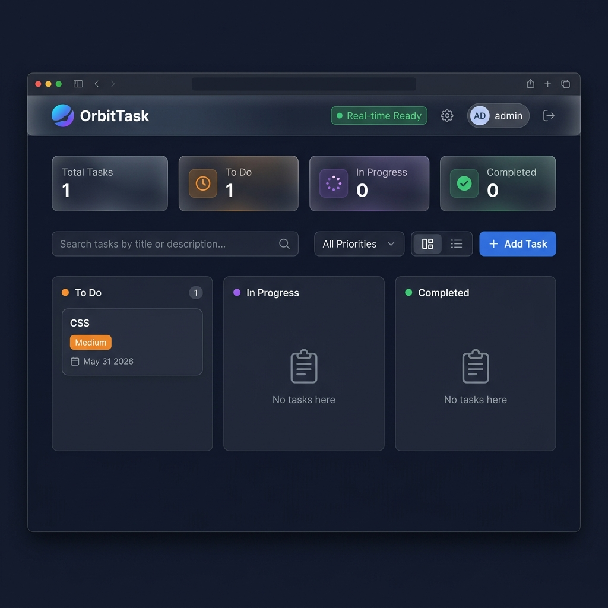
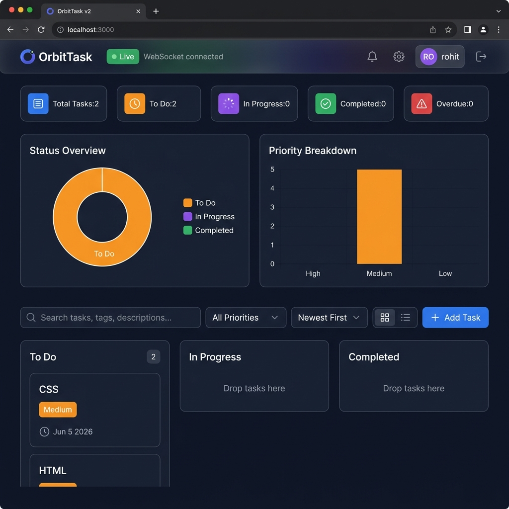

# OrbitTask 🚀

[](https://python.org)
[](https://fastapi.tiangolo.com)
[](https://scikit-learn.org)
[](https://render.com)
[](https://developer.mozilla.org/en-US/docs/Web/JavaScript)
[](LICENSE)
[](https://render.com)

> A full-stack task management web application with AI-powered NLP task categorization, real-time WebSocket sync, Kanban/List dual-view, and JWT authentication — built with FastAPI + Vanilla JS and deployed on Render.

---

## 🔗 Live Demo

**[https://orbittask-app.onrender.com](https://orbittask-app.onrender.com)**

> ⚠️ Running on Render free tier — first load may take ~30s (cold start). The loading screen will appear while the server wakes up.

---

## ✨ Features

| Feature | Status |
|---|---|
| JWT Authentication (register / login / logout) | ✅ |
| CRUD — Create, Read, Update, Delete tasks | ✅ |
| Kanban Board with SortableJS drag-and-drop | ✅ |
| List View with sortable columns | ✅ |
| **NLP Task Categorizer** (scikit-learn TF-IDF + Logistic Regression) | ✅ |
| AI-suggested priority & tags from task title | ✅ |
| Real-time sync via WebSockets | ✅ |
| Task tags / labels with color-coded chips | ✅ |
| Search across title, description, and tags | ✅ |
| Filter by priority, status, tag | ✅ |
| Sort by: newest, due date, priority, title A–Z | ✅ |
| Overdue task highlighting (red glow animation) | ✅ |
| Chart.js analytics — status doughnut + priority bar | ✅ |
| Pagination (server-side with X-Total-Count header) | ✅ |
| Browser push notifications for deadlines | ✅ |
| Dark / Light theme toggle (persisted) | ✅ |
| User profile modal with completion stats | ✅ |
| Cold-start loading indicator (Render free tier) | ✅ |
| Inline form validation with error messages | ✅ |
| Fully responsive (mobile / tablet / desktop) | ✅ |
| Deployed on Render with PostgreSQL | ✅ |
| IaC deployment via `render.yaml` | ✅ |
| Email notifications | ❌ (future scope) |
| Team collaboration / shared boards | ❌ (future scope) |

---

## 🤖 AI / NLP Feature

The **NLP Task Categorizer** uses a **scikit-learn ML pipeline** trained on 100+ hand-curated task examples:

```
TF-IDF Vectorizer (bigrams, 2000 features, sublinear TF)
        ↓
Logistic Regression (multinomial, C=1.5)
        ↓
Category + Confidence Score + Suggested Priority + Tags
```

**8 Categories:** Development · Design · Research · Testing · Personal · Admin · Learning · Urgent

**How it works:**
- As you type a task title (with 600ms debounce), the frontend calls `POST /api/ai/categorize`
- The ML model returns the predicted category (e.g. "Development"), confidence %, suggested priority ("high"/"medium"/"low"), and recommended tags
- These are automatically applied to the form fields
- A badge shows: *"🤖 Category: Development (87% confidence) — Priority: medium"*

---

## 🛠️ Tech Stack

| Layer | Technology |
|---|---|
| **Backend** | Python 3.11, FastAPI, Uvicorn |
| **ML / NLP** | scikit-learn (TF-IDF + Logistic Regression), NumPy |
| **Authentication** | JWT (python-jose), bcrypt (passlib) |
| **Database** | PostgreSQL (Render prod) / SQLite (local dev) |
| **ORM** | SQLAlchemy 2.x |
| **Real-time** | WebSockets (FastAPI native) |
| **Frontend** | Vanilla JavaScript (ES6+), HTML5, CSS3 |
| **Charts** | Chart.js 4.4 |
| **Drag & Drop** | SortableJS 1.15 |
| **Icons** | Font Awesome 6 |
| **Fonts** | Google Fonts (Inter, Outfit) |
| **Hosting** | Render (web service + PostgreSQL database) |
| **CI/CD** | GitHub → Render auto-deploy on push |

---

## 📸 Screenshots

### 🌐 Render Deployment — Live Production App
> Deployed on Render free tier with auto-deploy from GitHub



---

### 💻 Local Dev Server — v2 with Chart.js Analytics
> Full feature set: status doughnut chart, priority bar chart, 5 stat cards, SortableJS Kanban



---

## 🚀 Local Setup

### Prerequisites
- Python 3.11+
- Git

### 1. Clone the repository
```bash
git clone https://github.com/rohit200573-commits/Task-Management-Application.git
cd Task-Management-Application
```

### 2. Create and activate virtual environment
```bash
# Windows
python -m venv venv
.\venv\Scripts\activate

# macOS / Linux
python3 -m venv venv
source venv/bin/activate
```

### 3. Install dependencies
```bash
pip install -r backend/requirements.txt
```

### 4. Run the server
```bash
python backend/run.py
```

### 5. Open the app
Visit **[http://127.0.0.1:8000](http://127.0.0.1:8000)** in your browser.

> The SQLite database (`tasks.db`) is created automatically on first run.

---

## 📡 API Endpoints

Base URL: `http://127.0.0.1:8000/api` (local) | `https://orbittask-app.onrender.com/api` (production)

### Authentication
| Method | Endpoint | Description | Auth |
|---|---|---|---|
| `POST` | `/auth/register` | Create new user account | ❌ |
| `POST` | `/auth/login` | Login with username + password (form data) | ❌ |
| `GET` | `/auth/me` | Get current user info | ✅ Bearer |

### Tasks
| Method | Endpoint | Query Params | Description | Auth |
|---|---|---|---|---|
| `GET` | `/tasks` | `search`, `priority_filter`, `status_filter`, `tag_filter`, `sort_by`, `page`, `page_size` | List tasks (paginated) | ✅ |
| `POST` | `/tasks` | — | Create new task | ✅ |
| `PUT` | `/tasks/{id}` | — | Update task | ✅ |
| `DELETE` | `/tasks/{id}` | — | Delete task | ✅ |

### AI / NLP
| Method | Endpoint | Body | Description | Auth |
|---|---|---|---|---|
| `POST` | `/ai/categorize` | `{"text": "..."}` | NLP classify task text → category + priority + tags | ✅ |

### Analytics
| Method | Endpoint | Description | Auth |
|---|---|---|---|
| `GET` | `/stats` | Task counts by status, priority, overdue | ✅ |

**Task object schema:**
```json
{
  "id": 1,
  "title": "Build API endpoint",
  "description": "Implement the user authentication route",
  "status": "todo | in_progress | done",
  "priority": "low | medium | high",
  "due_date": "2024-12-31",
  "tags": "dev,backend,api",
  "created_at": "2024-01-15T10:30:00",
  "owner_id": 1
}
```

---

## 🏗️ Project Structure

```
Task-Management-Application/
├── backend/
│   ├── app/
│   │   ├── __init__.py
│   │   ├── main.py          # FastAPI routes, WebSocket, static serving
│   │   ├── models.py        # SQLAlchemy ORM models (User, Task)
│   │   ├── schemas.py       # Pydantic request/response schemas
│   │   ├── database.py      # PostgreSQL / SQLite engine setup
│   │   ├── auth.py          # JWT auth, password hashing
│   │   └── nlp_model.py     # scikit-learn NLP pipeline (AI feature)
│   ├── requirements.txt
│   └── run.py               # Uvicorn entrypoint (local dev)
├── frontend/
│   ├── index.html           # Single-page app shell
│   ├── style.css            # Design system + all component styles
│   └── app.js               # All JS — auth, CRUD, charts, WS, NLP
├── render.yaml              # Render IaC — web service + PostgreSQL
└── README.md
```

---

## ☁️ Deploy on Render

This project uses **Infrastructure as Code** via `render.yaml` — no manual config needed.

1. Fork this repository
2. Go to [render.com](https://render.com) → **New** → **Blueprint**
3. Connect your GitHub repo
4. Render will automatically read `render.yaml` and provision:
   - A **Python web service** (OrbitTask app)
   - A **Free PostgreSQL database** (auto-linked via `DATABASE_URL`)
5. After ~3-4 minutes: your app is live! 🎉

**Manual deploy option:**

| Setting | Value |
|---|---|
| Runtime | Python 3 |
| Build Command | `pip install -r backend/requirements.txt` |
| Start Command | `uvicorn app.main:app --host 0.0.0.0 --port $PORT --app-dir backend` |
| Env Var: `JWT_SECRET_KEY` | Generate a secure random value |
| Env Var: `DATABASE_URL` | From your Render PostgreSQL connection string |

---

## 🔭 Future Scope

- [ ] **Email notifications** — SMTP integration (SendGrid / Gmail) for deadline reminders
- [ ] **Team boards** — Shared workspaces with role-based access control
- [ ] **File attachments** — Attach documents/images to tasks
- [ ] **Recurring tasks** — Daily, weekly, monthly task schedules
- [ ] **Mobile app** — React Native / Flutter wrapper
- [ ] **Advanced NLP** — Train on user's own task history for personalized categories
- [ ] **Calendar view** — Timeline visualization of due dates
- [ ] **Integrations** — Slack, Google Calendar, GitHub Issues
- [ ] **OAuth2** — Sign in with Google / GitHub

---

## 📄 License

MIT License — see [LICENSE](LICENSE) for details.

---

<div align="center">
Built with ❤️ using FastAPI + scikit-learn + Vanilla JS
</div>
